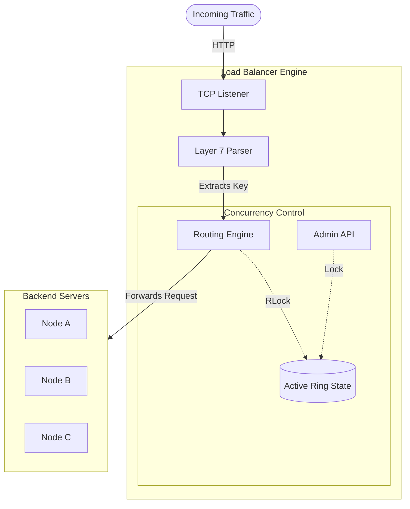

# lb

A Layer 7 HTTP load balancer using consistent hashing, written in Go as a learning project.



## Quick start

```bash
# Build
make build

# Run with two backends pre-registered
./lb --listen :8080 --admin :9090 --backends "api:10.0.0.1:8081,default:10.0.0.2:8082"
```

## Admin commands

Manage backends at runtime while the load balancer is running (admin port default `:9090`).

```bash
# Add a backend to a ring
curl -X POST http://localhost:9090/admin/backends \
  -H "Content-Type: application/json" \
  -d '{"ring":"api","addr":"10.0.0.1:8081"}'

# Add a backend to the default (catch-all) ring
curl -X POST http://localhost:9090/admin/backends \
  -H "Content-Type: application/json" \
  -d '{"ring":"default","addr":"10.0.0.3:8082"}'

# Remove a backend from a ring
curl -X DELETE http://localhost:9090/admin/backends \
  -H "Content-Type: application/json" \
  -d '{"ring":"api","addr":"10.0.0.1:8081"}'
```

See [docs/admin-api.md](docs/admin-api.md) for the full reference, response codes, and security notes.

## Development

```bash
make vet    # static analysis
make build  # compile
make test   # run tests with race detector
```

## Docs

- [Architecture](docs/architecture.md) — components, request lifecycle, concurrency model
- [Admin API](docs/admin-api.md) — runtime backend management
