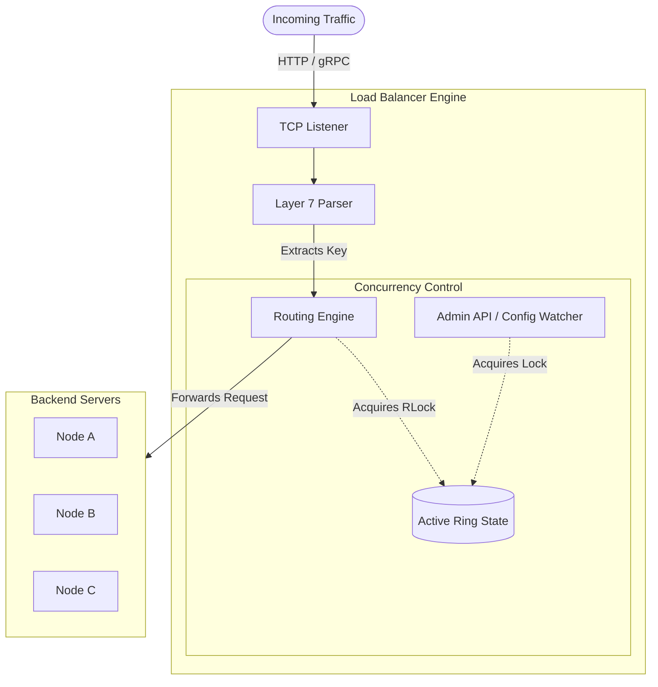

```mermaid
flowchart TD
    Clients([Incoming Traffic]) -->|HTTP / gRPC| Listener[TCP Listener]
    
    subgraph Load Balancer Engine
        Listener --> L7Parser[Layer 7 Parser]
        L7Parser -->|Extracts Key| Router[Routing Engine]
        
        subgraph Concurrency Control
            Router -.->|Acquires RLock| RingState[(Active Ring State)]
            AdminAPI[Admin API / Config Watcher] -.->|Acquires Lock| RingState
        end
    end

    Router -->|Forwards Request| Pool

    subgraph Pool[Backend Servers]
        ServerA[Node A]
        ServerB[Node B]
        ServerC[Node C]
    end
```
