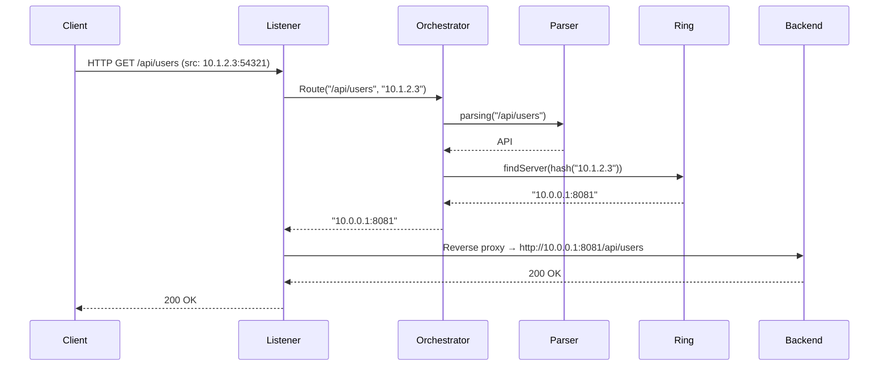

# Architecture

## Overview

`lb` is a Layer 7 (application-layer) HTTP load balancer. It sits in front of a pool of backend servers and distributes incoming requests using **consistent hashing** on the client's IP address. Routing is ring-scoped: different URL prefixes map to different backend pools, each managed as its own hash ring.

The key design goals are:

- **Deterministic routing** — the same client IP always reaches the same backend (as long as the ring does not change), which keeps session state and caches warm.
- **Lock-safe hot reconfiguration** — backends can be added or removed at runtime through the Admin API without stopping traffic. Reads hold an `RLock`; writes hold a full `Lock`.
- **Minimal dependencies** — the entire implementation uses only the Go standard library.

---

## Repository layout

```
.
├── cmd/
│   └── lb/
│       └── main.go          # entry point: flag parsing, wiring, graceful shutdown
├── internal/
│   └── engine/
│       ├── ring.go          # consistent hashing ring
│       ├── parser.go        # URL prefix → RingType router
│       ├── orchestrator.go  # glue: parser + ring lookup
│       ├── listener.go      # HTTP reverse proxy (inbound traffic)
│       ├── admin.go         # Admin HTTP API (runtime config)
│       └── engine_test.go   # unit tests
├── docs/
│   ├── architecture.md      # this file
│   └── admin-api.md         # Admin API reference
├── .github/workflows/ci.yml # CI pipeline
├── Makefile
└── go.mod
```

---

## Component breakdown

### 1. Consistent hashing ring (`ring.go`)

The ring is the core data structure. Each backend server is mapped to a point on a virtual number line by hashing its address with **FNV-32a**. The points are kept in a sorted `[]int32` slice (`serverList`). A parallel `map[int32]string` (`servers`) maps each hash back to the original address string.

```
serverList  [ -2147483648 ]  [ 42 ]  [ 819 ]  [ 2000 ]  ...
servers       hash → addr     hash → addr  ...
```

**Finding a server for a client:**

1. Hash the client IP with `hashAddr(clientIP)` → `clientHash`.
2. Binary-search `serverList` for the first hash `>= clientHash` (clockwise walk).
3. If `clientHash` is larger than every node, wrap around to index 0.
4. Look up the address from `servers[serverList[idx]]`.

This ensures that adding or removing a single node only remaps the clients that were assigned to that node — not the entire fleet.

**Concurrency:** every read (find) holds `mu.RLock`; every write (add/remove) holds `mu.Lock`. The ring is safe for concurrent use by many goroutines.

```
type Ring struct {
    mu         sync.RWMutex
    serverList []int32          // sorted hashes
    servers    map[int32]string // hash → address
}
```

**FNV-32a hash**

`hashAddr` converts an address string to `int32` using the 32-bit FNV-1a algorithm from `hash/fnv`. The cast to `int32` can produce negative values; the binary search comparisons still work correctly because Go integer comparisons are signed.

---

### 2. URL prefix parser (`parser.go`)

The parser maps a request URL path to a `RingType`. A `RingType` is just a string constant that identifies a backend pool.

```
type RingType string

const (
    API     RingType = "api"
    Default RingType = "default"
)
```

The `prefix` map declares which URL prefixes belong to which ring:

```go
var prefix = map[string]RingType{
    "/api": API,
}
```

`parsing(url string) RingType` iterates the map and returns the first matching `RingType` via `strings.HasPrefix`. If no prefix matches, it returns `Default`.

To add a new route category, add an entry to `prefix` and a corresponding `RingType` constant:

```go
const (
    API     RingType = "api"
    Static  RingType = "static"
    Default RingType = "default"
)

var prefix = map[string]RingType{
    "/api":    API,
    "/static": Static,
}
```

> **Limitation:** the current implementation returns the first match from a Go map iteration, which is randomised. If two prefixes overlap (e.g. `/api` and `/api/v2`) the result is non-deterministic. For production use, sort prefixes by descending length before matching.

---

### 3. Orchestrator (`orchestrator.go`)

The Orchestrator is the central coordinator. It owns the map of rings and exposes the two operations the rest of the system needs:

| Method                                            | Description                                           |
| ------------------------------------------------- | ----------------------------------------------------- |
| `Route(url, clientIP string) (string, error)`     | Resolve which backend address to use for this request |
| `AddBackend(ring RingType, addr string) error`    | Register a new backend server at runtime              |
| `RemoveBackend(ring RingType, addr string) error` | Deregister a backend server at runtime                |

```
type Orchestrator struct {
    mu       sync.RWMutex
    ringList map[RingType]*Ring
    parser   Parser
}
```

**Route flow:**

1. `parser.parsing(url)` → `ringType`
2. Look up `ringList[ringType]` (under `mu.RLock`)
3. If not found and `ringType != Default`, try `ringList[Default]` as a fallback
4. Call `ring.findServer(hashAddr(clientIP))`

**AddBackend flow:**

1. Acquire `mu.Lock`
2. If `ringList[ringType]` does not exist, create a new ring
3. Release `mu.Lock`
4. Call `ring.addServer(addr)` — the ring's own lock takes over from here

The two-phase locking (orchestrator lock then ring lock) avoids holding the orchestrator lock during the more expensive ring insertion.

**Fallback ring**

If a request arrives for a ring that has no registered backends (e.g. no backends have been added to the `api` ring yet), the orchestrator transparently falls back to the `default` ring. This means you can always have a catch-all pool running even before specialised pools are populated.

---

### 4. HTTP listener / reverse proxy (`listener.go`)

The `Listener` wraps a standard `*http.Server` and implements `http.Handler`. It is the public-facing entry point for all client traffic.

**Per-request flow:**

1. Extract the client IP from `r.RemoteAddr` (strips the port with `net.SplitHostPort`).
2. Call `orchestrator.Route(r.URL.Path, clientIP)` → `backendAddr`.
3. Parse `backendAddr` into a `*url.URL` (`http://<addr>`).
4. Create a `httputil.ReverseProxy` targeting that URL and call `proxy.ServeHTTP`.

A custom `ErrorHandler` on the proxy returns `502 Bad Gateway` with the underlying error message if the upstream connection fails.

> **Note:** a new `ReverseProxy` instance is created per request. This is intentional: the target address can change between requests (because the ring can be mutated at runtime), so caching a proxy instance per backend would require its own invalidation logic.

---

### 5. Admin API (`admin.go`)

The `AdminServer` runs on a **separate port** (default `:9090`) so that management traffic is isolated from client traffic and can be firewalled independently.

It registers a single handler at `/admin/backends` that dispatches on the HTTP method:

| Method   | Action                                          |
| -------- | ----------------------------------------------- |
| `POST`   | Add a backend → `orchestrator.AddBackend`       |
| `DELETE` | Remove a backend → `orchestrator.RemoveBackend` |

All state mutations flow through the Orchestrator, which holds the appropriate locks. The Admin API itself has no additional locking.

See [admin-api.md](admin-api.md) for the full API reference.

---

### 6. Entry point (`cmd/lb/main.go`)

`main` wires all components together and manages the process lifecycle.

**Startup sequence:**

1. Parse CLI flags (`--listen`, `--admin`, `--backends`).
2. Create an `Orchestrator`.
3. Parse `--backends` (format: `ring:host:port`, comma-separated) and call `AddBackend` for each entry.
4. Create a `Listener` and `AdminServer`, both backed by the same `Orchestrator`.
5. Start both servers in separate goroutines.
6. Block on `SIGINT` / `SIGTERM`.

**Graceful shutdown:**

On signal, a `context.WithTimeout(10s)` is passed to both `Listener.Shutdown` and `AdminServer.Shutdown`. This calls the underlying `http.Server.Shutdown`, which stops accepting new connections and waits for in-flight requests to complete (up to the deadline).

---

## Request lifecycle (end-to-end)



---

## Concurrency model

The system has two layers of locking:

| Layer        | Guard                              | Protects                                                                                                                    |
| ------------ | ---------------------------------- | --------------------------------------------------------------------------------------------------------------------------- |
| Orchestrator | `Orchestrator.mu` (`sync.RWMutex`) | `ringList` map — reads from `Route` hold RLock; writes from `AddBackend` hold Lock                                          |
| Ring         | `Ring.mu` (`sync.RWMutex`)         | `serverList` slice and `servers` map — reads from `findServer` hold RLock; writes from `addServer`/`removeServer` hold Lock |

Readers never block each other. A write (backend add/remove) briefly pauses new reads on that ring but does not affect other rings. This means a ring addition for the `static` pool does not pause routing for the `api` pool.

```
Orchestrator.mu.RLock  ──────────────────────────────────────┐
                                                             │ Route()
    Ring.mu.RLock  ────────────────────────────────────┐     │
                                                       │     │
        findServer()  ─── binary search ────────────── │─────┘
                                                       │
    Ring.mu.RUnlock ───────────────────────────────────┘

Orchestrator.mu.Lock  ─────────────────────────────────────┐
                                                           │ AddBackend()
    (create ring if needed)                                │
                                                           │
Orchestrator.mu.Unlock ────────────────────────────────────┘

    Ring.mu.Lock  ─────────────────────────────────────────┐
                                                           │ addServer()
        (sorted insert into serverList)                    │
                                                           │
    Ring.mu.Unlock ────────────────────────────────────────┘
```

The race detector (`go test -race`) validates this model in CI.

---

## Extending the system

### Adding a new ring type

1. Add a constant to `ring.go`:
   ```go
   const (
       API     RingType = "api"
       Static  RingType = "static"   // new
       Default RingType = "default"
   )
   ```
2. Register its prefix in `parser.go`:
   ```go
   var prefix = map[string]RingType{
       "/api":    API,
       "/static": Static,  // new
   }
   ```
3. Register backends at startup via `--backends "static:10.0.0.5:8083"` or at runtime via the Admin API.

### Replacing FNV with a different hash

Swap the body of `hashAddr` in `ring.go`. The function signature is `func hashAddr(addr string) int32` — any deterministic mapping from string to int32 works.

### Adding virtual nodes (vnodes)

To improve distribution uniformity, multiply each backend across `N` points on the ring by hashing `addr + strconv.Itoa(i)` for `i` in `[0, N)`. The `addServer` and `removeServer` methods would need to loop over the N replicas.
